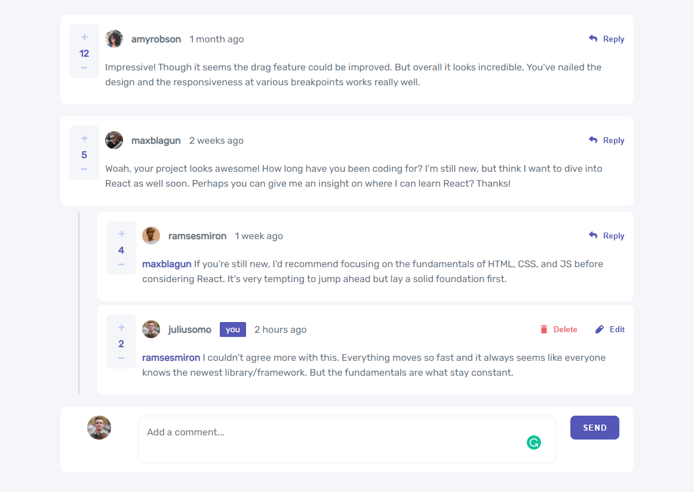

# Frontend Mentor - Interactive comments section solution

This is a solution to the [Interactive comments section challenge on Frontend Mentor](https://www.frontendmentor.io/challenges/interactive-comments-section-iG1RugEG9). Frontend Mentor challenges help you improve your coding skills by building realistic projects. 

## Table of contents

- [Overview](#overview)
  - [The challenge](#the-challenge)
  - [Screenshot](#screenshot)
  - [Links](#links)
- [My process](#my-process)
  - [Built with](#built-with)
  - [What I learned](#what-i-learned)
  - [Continued development](#continued-development)
- [Author](#author)

## Overview

### The challenge

Users should be able to:

- View the optimal layout for the app depending on their device's screen size
- See hover states for all interactive elements on the page
- Create, Read, Update, and Delete comments and replies
- Upvote and downvote comments
- **Bonus**: If you're building a purely front-end project, use `localStorage` to save the current state in the browser that persists when the browser is refreshed.
- **Bonus**: Instead of using the `createdAt` strings from the `data.json` file, try using timestamps and dynamically track the time since the comment or reply was posted.

### Screenshot

### Links

- Live Site URL: https://interactive-comments-section-main.netlify.app/

## My process

### Built with

- Semantic HTML5 markup
- Sass
- CSS custom properties
- Flexbox
- CSS Grid
- ReacJS

### What I learned

During the creation of this project, I mostly recapped all the concepts I've learned in React/Redux and Sass.
At the beginning of the project I configured everything manually using webpack, then switched to the create-react-app solution because that provides mmany more features automatically.

I learned how to use Sass and React at the same time.
I recapped Redux, and integrated Redux in my application in order to store the comments and make changes easily on them. In order to make this easier I used one of the most popular ways: Redux slices (using redux toolkit).

### Continued development

I'd like to create the same application using React Class based components instead of functional components (on a sepparate branch).
I'd like to make possible that one person can only give one upvote or downvote.
I'd like to connect the application to a backend, therefore the comment section will be shared between all the users, but for this, a registration is needed in order for the users to have separate accounts, but this is out of the challenge's scope.

## Author

- Frontend Mentor - [@Lorand98](https://www.frontendmentor.io/profile/Lorand98)
- Twitter - [@LorandKalmar](https://twitter.com/LorandKalmar)

